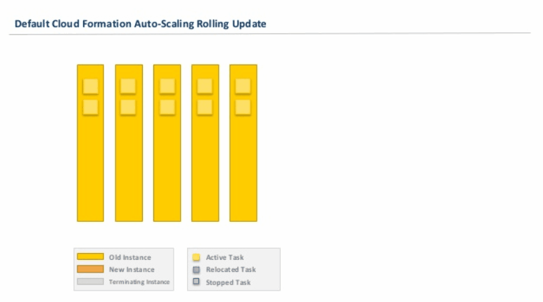

# Lambdas for zero down-time ECS cluster upgrades

This repository contains two lambdas which facilitate zero downtime removal of container instances from an ECS cluster, for example during scale-ins or rolling cluster updates.

## Drain lambda

A container instance can be gracefully removed from the cluster by setting its state to `DRAINING` and giving it some time. ECS scheduler will take care of shifting service tasks to other container instances in the cluster. It's important to note here that tasks which _don't_ belong to an ECS service (e.g. daemon tasks that must run on each node similar to Kubernetes DaemonSet) are _not_ affected by this, and we have to manage them separately.

We can automate this process by leveraging Auto Scaling lifecycle hooks. [This blog post from AWS](https://aws.amazon.com/blogs/compute/how-to-automate-container-instance-draining-in-amazon-ecs/) explains this process well, but at the high level the sequence of actions looks like this:

- When the Auto Scaling Group initiates the termination of one of the instances, the lifecycle hook gets triggered and puts the server into `Terminating:Wait` state. It will remain in this state until the timeout period ends or some external agent completes the lifecycle action, which continues the termination process.

- The lifecycle hook also sends a message to an SNS topic.

- This message invokes a lambda, which finds the container instance id of the EC2 instance about to be terminated, puts it into `DRAINING` state if it isn't in it already, and checks if there are any tasks still running on this server.

  - If there are any, the lambda sends another message to the same SNS topic to trigger itself again.

  - If the instance has no running tasks, the lambda completes the lifecycle action, and the Auto Scaling group terminates the server.

The drain lambda is inspired by [ecs-cid-sample](https://github.com/aws-samples/ecs-cid-sample); however, it was written from scratch to solve several important issues:

- Setting an instance to `DRAINING` state shuts down all ECS services running on this instance. The tasks which are not part of a service (for example, [daemon tasks](https://aws.amazon.com/blogs/compute/running-an-amazon-ecs-task-on-every-instance/) running on each instance) are not affected. Drain lambda can deal with this situation by stopping such tasks directly instead of relying on ECS to stop them. Daemon tasks need to have short instance ARN (e.g. `5a30dbba-a868-4268-ac25-63168624b6c8`) in their `startedBy` attribute.

- The original lambda essentially runs in a very tight infinite loop and only breaks out of it if either there are no more tasks running on the instance, or it reaches the heartbeat timeout on the lifecycle hook. Because ECS scheduler cannot migrate the daemon tasks, the lambda sends an excessive number of SNS messages and keeps invoking itself until the heartbeat timeout runs out. To resolve this, in addition to handling daemon tasks we have added a stagger to lambda executions, as well as a circuit breaker for situations when lambda is invoked more than a certain number of times on the same instance.

- The original lambda makes API calls on each invocation to retrieve any parameters it needs, such as container instance id or SNS topic ARN. Combined with previous two points, this results in getting rate-limited by AWS. The lambda can’t retrieve the parameters it needs any more, and even web console becomes inoperable, which is a deal breaker during cluster upgrades. Since in many cases the lambda is invoked by an SNS message that is sent from the lambda itself, we can pass such parameters as part of this message, thus avoiding unnecessary API calls.

## Tag lambda

Tasks running on an instance which is in `DRAINING` state are gradually moved to active servers. However, ECS scheduler is not aware of Auto Scaling events, so in many cases, this can be an instance which will be terminated next. The result may be that running tasks are shifted from one old instance to another until they finally bunch up on a few of the new ones.
This gif, captured from [excellent presentation](https://www.slideshare.net/mcallana/con314-automating-zerodowntimeproductionclusterupgradesforamazonecs), can illustrate the whole process.



ECS Task Placement Constraints allow us to specify rules which considered during task placement. For example, we can constrain the task to only run on given instance types. We can also specify other parameters, such as tags, and only allow task placement on instances which don't have a certain tag. The complete process looks like this:

1. All ECS tasks that we care about are constrained to instances which either don't have the tag `drain`, or don't have it set to `true` (this approach was first suggested in [this issue](https://github.com/aws/amazon-ecs-agent/issues/672#issuecomment-345930571) in the ECS agent repository). Here's a Terraform snippet which achieves this:

```javascript
placement_constraints {
  type       = "memberOf"
  expression = "attribute:drain !exists or attribute:drain != true"
}
```

2. Before triggering the update of the CloudFormation stack, the lambda marks all currently running instances with `drain = true` tag, so the scheduler cannot place any new tasks on them. Tagging the ECS nodes should be a separate CI/CD step.

3. New instances created during the rollout don't have this tag and can receive new tasks. To prevent tasks from congregating on the few instances launched first, the `MaxBatchSize` parameter should be reasonably large, perhaps close to `DesiredCapacity` parameter.

4. If the stack update fails (or there are no changes to be applied), we should reset the tag so ECS tasks can be placed on the old instances again.

## How to use

1. Deploy lambdas in your account. This repository contains a ready-to-use Terraform module, which requires only the `region` parameter as input:

```javascript
module "ecs_update_lambdas" {
  source = "git::https://github.com/praveensastry/ecs-cluster-update-lambda.git//src"
  region = "${var.region}"
}
```

2. Send notifications to the SNS topic created by this Terraform module on all important Auto Scaling events:

```yaml
  ASG:
    Type: AWS::AutoScaling::AutoScalingGroup
      <...>
      NotificationConfigurations:
      - TopicARN: "${data.terraform_remote_state.lambda.sns_arn}"
        NotificationTypes:
        - autoscaling:EC2_INSTANCE_LAUNCH
        - autoscaling:EC2_INSTANCE_LAUNCH_ERROR
        - autoscaling:EC2_INSTANCE_TERMINATE
        - autoscaling:EC2_INSTANCE_TERMINATE_ERROR
```

3. Add a lifecycle hook resource:

```yaml
ASGTerminateHook:
  Type: "AWS::AutoScaling::LifecycleHook"
  Properties:
    AutoScalingGroupName: !Ref ASG
    DefaultResult: "ABANDON"
    HeartbeatTimeout: "900"
    LifecycleTransition: "autoscaling:EC2_INSTANCE_TERMINATING"
    NotificationTargetARN: "${data.terraform_remote_state.lambda.sns_arn}"
    RoleARN: "${aws_iam_role.asg.arn}"
```

These examples use HCL syntax to substitute variables in the CloudFormation template, but can easily be adapted to standard YAML or JSON CloudFormation syntax.

Only two parameters are required:

- `TopicARN` / `NotificationTargetARN` — the ARN of the SNS topic that drain-lambda subscribes to. Terraform exposes it as an output of this module.
- `RoleARN` — the IAM role which allows ASG to post to the SNS topic. Its definition can look like this:

```javascript
resource "aws_iam_role" "asg" {
  name               = "${var.iam_asset_prefix}-asg-${var.region}"
  assume_role_policy = "${data.aws_iam_policy_document.asg.json}"
}

data "aws_iam_policy_document" "asg" {
  statement {
    actions = ["sts:AssumeRole"]

    principals {
      type = "Service"

      identifiers = [
        "autoscaling.amazonaws.com",
      ]
    }
  }
}

resource "aws_iam_role_policy_attachment" "asg" {
  role       = "${aws_iam_role.asg.name}"
  policy_arn = "arn:aws:iam::aws:policy/service-role/AutoScalingNotificationAccessRole"
}
```

4. Before triggering a rolling update of the Auto Scaling group, run tag lambda to set the `drain` tag to `true`. This can be done using [this script](./scripts/run_tag_lambda.sh).

For example, on Jenkins:

```groovy
pipeline {
  // ...
  environment {
    STACK_NAME = "default"
  }
  stages {
    stage('Taint container instances'){
      steps {
        tag('true')
      }
    }
  // ...
}

def tag(drain) {
  withEnv(["STACK_NAME=${STACK_NAME}", "DRAIN_TAG=${drain}"]) {
    sh "./scripts/run_tag_lambda.sh"
  }
}
```

After the deployment is complete and regardless of whether it was successful or not, reset the tag. This step can be done using a simple post-build step in the Jenkinsfile, or something similar for other CI systems:

```groovy
post {
  always{
    // Clear up old instances
    tag('false')
  }
}
```
